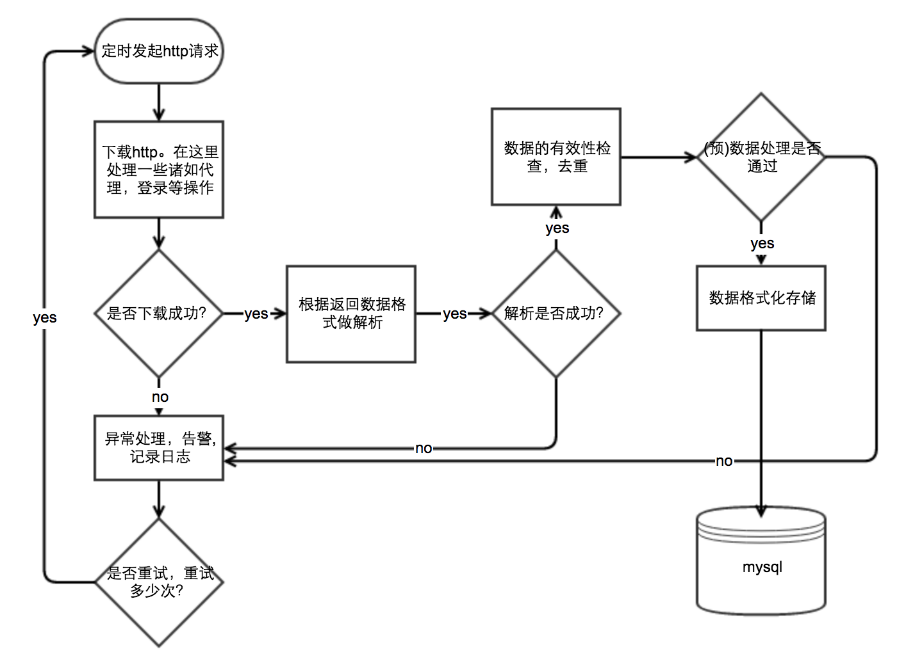
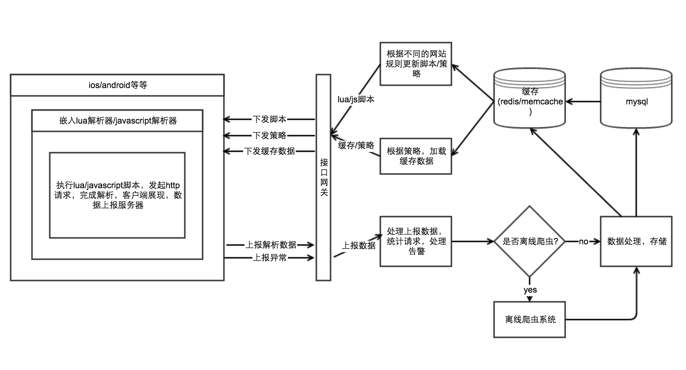
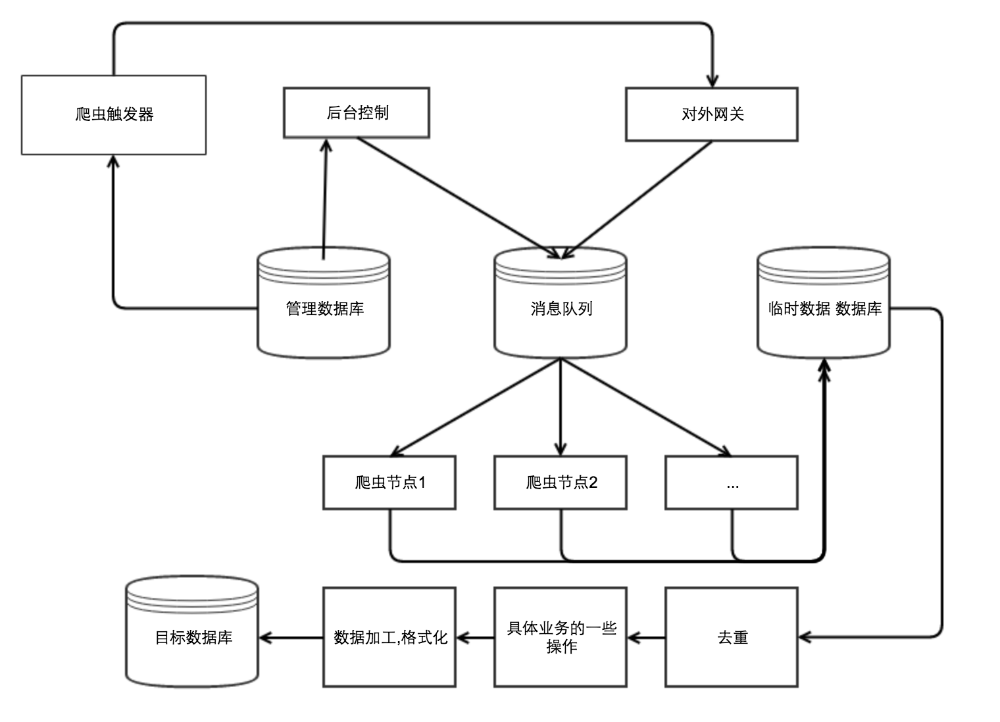

都说年末了，该给自己写写总结了。今天我想谈一谈的是我在公司这一年多里的负责的部分工作---爬虫。做了这么久的爬虫，是该写点什么，留下点什么。在我所负责的这一段时间了。我总结了一下大概有以下几类爬虫设计思想。

- 简单服务器定时爬虫
- 客户端爬虫
     + lua解析
     + javascript解析
- 服务器离线爬虫

下面在来细聊以下。

## 服务器-定时简单爬虫
在最开始的时候，我们做的就是这个。这应该是最简单的爬虫了。搜索引擎搜出来的大概就是这一类了。

这一类的爬虫特点是我只需要爬取一个网站的某一部分数据，发起http请求做html解析，然后存数据库，就完了。比如一些其他网站提供的一些公共数据，或者不要求实时性的数据。如汽车之家的汽车数据，如英雄联盟的英雄数据，如政府网站的某些展示数据。我用过[scrapy](https://scrapy.org/)来抓取dota2的一些数据，后来发现scrapy不一定完全在自己掌控中，我自己写了一个爬虫框架，叫[Tspider](https://github.com/hirudy/Tspider)。我现在做一些简单的爬虫都会用它。基于php的协程与curl_multi_*函数集实现的。单进程可到2000有效处理/min。

这一类的爬虫处理流程大概类似如下

网上宣传的诸如《xxx抓取淘宝MM照片》、《我从知乎偷取了多少数据》等等爬虫，大概如此。《21天精通xx语言》的既视感。

这一类的爬虫的优点大概就是简单吧。

## 客户端解析（lua、javascript）
我们公司是做移动端产品的，假如你也恰好是有（android/ios）客户端支持的。并且对数据的实时性要求较高，或者爬数据的时候ip封的太厉害了。可以试试我下面说的方式。我给他取名叫`客户端解析`。

在这一类爬虫中，需要客户端嵌入脚本执行引擎。把http的请求与数据解析放到客户端去执行。最后把数据呈现出来或者上报给服务器。准确度、实时性较高。

- 脚本：脚本的作用不过是把对应网站的数据（json、jsonp，html等等）转换为我们需要的数据（格式化数据）。当对方做出改变，我们只需要改变脚本就行。
- 策略：策略的作用是告诉客户端，你们需要某部分时候，去执行脚本中的哪个方法？ 是否需要缓冲？是否需要展示原始网站的内容？等等一些通过服务器控制客户端行为的东西。
- 离线爬虫：是否需要在服务器爬取，将请求丢给消息队列，离线爬虫系统自己一边玩去。

这种方式至少有两个优点：ip离散，实时性较高。

## 服务器-离线爬虫系统
对于绝大部分服务，数据的爬取需求，还是需要在服务器完成的。对于这一类的爬虫。架构的设计，需要有很好的扩展性。

- 爬取请求从后台控制、对外网关而来。
- 爬虫触发器，就是通过消息队列告诉爬虫节点啥时候爬，爬谁的数据。
- 后台控制，可以控制支持哪些网站的数据，告警，异常管理。
- 消息队列用于分发消息给某个爬虫节点。
- 爬虫节点：完成具体的爬虫，格式化爬虫数据。支持某个网站的爬取，通常修改此次就行了，这里也需要做好统计，做好告警。
- 去重：去重可以试试`布隆过滤器`与`simhash指纹算法和海明距离比较`。

## 思想或叫准则吧
总结一下：

- 只关心对的，不关心错的。错误的，你永远也枚举不完。
- 在分层结构中，应该是越往最内层，数据(请求)越小，有效数据(请求)占比越高。
- 备份思想很重要。如果一台机器挂断的概率是百分之一，两台机器同时挂掉的概率就是万分之一。
- 没有什么万能钥匙，具体问题，具体分析，具体解决。
- 没有什么完美的解决方案，有些时候需要根据业务做一些取舍。

最后，感谢我的leader——corey，谢谢！