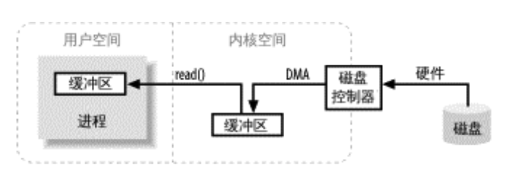
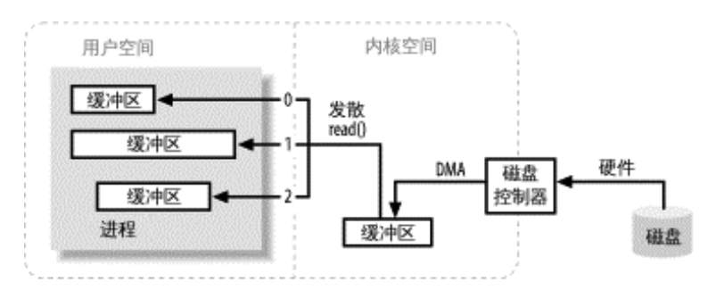
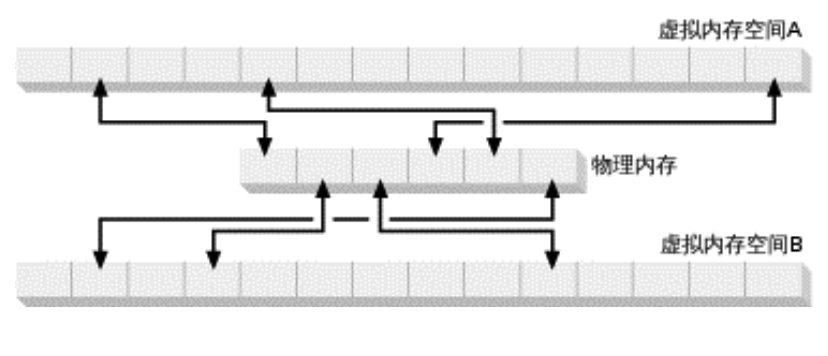
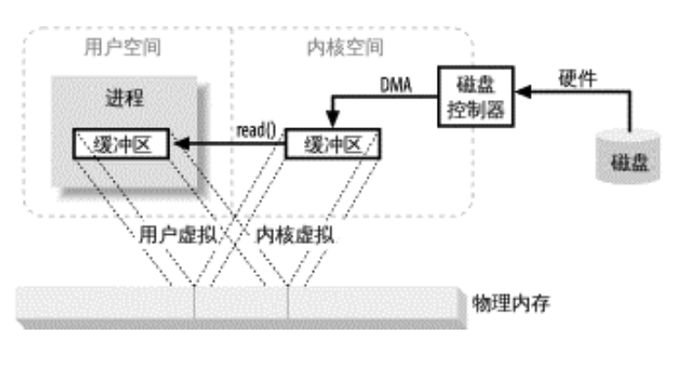
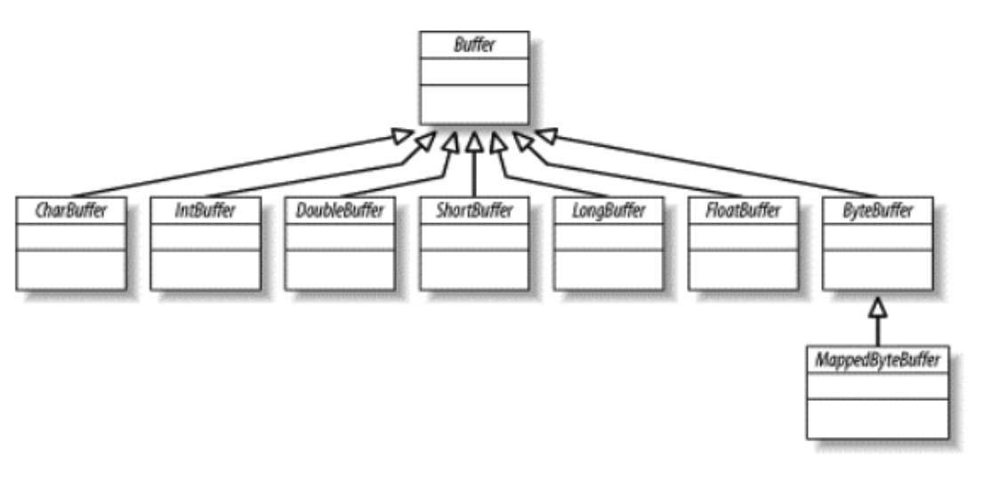
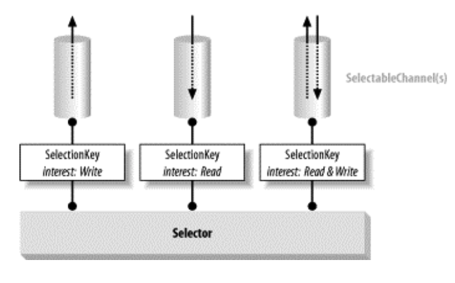

## 简介
从JDK1.4开始，java中提供一个种叫NIO(Non-Blocking IO)的IO处理机制。与以往的标准IO机制(BIO,Blocking IO)不同的是，新的机制把重点放在了如何缩短抽象与现实之间的距离上面。NIO中提出了一种新的抽象，NIO 弥补了原来的BIO的不足，它在标准 Java 代码中提供了高速的、面向块的I/O。

NIO的包括三个核心概念:缓冲区(Buffer)、通道(Channel)、选择器(Selector)。

## BIO与NIO
BIO与NIO之间的共同点是他们都是同步的。而非异步的。
- BIO是阻塞的(当前线程必须等待感兴趣的事情发生), NIO是非柱塞的(事件选择，感兴趣的事情发生可以通知线程，而不必一直在哪等待);
- BIO是面向流式的IO抽象(一次一个字节地处理数据), NIO是面向块的IO抽象(每一个操作都在一步中产生或者消费一个数据块(Buffer));
- BIO的服务器实现模式为一个连接一个线程，NIO服务器实现模式为一个请求一个线程;

## 前提概念

#### 缓冲区操作:
缓冲区，以及缓冲区如何工作，是所有 I/O 的基础。所谓“输入/输出”讲的无非就是把数据移进或移出缓冲区。进程执行 I/O 操作，归结起来，也就是向操作系统发出请求，让它要么把缓冲区里的数据排干 (写)，要么用数据把缓冲区填满(读)。大致流程如图：



注意图中用户空间和内核空间的概念。用户空间是常规进程所在区域。JVM就是常规进程，驻守于用户空间。用户空间是非特权区域(比如，在该区域执行的代码就不能直接访问硬件设备)。内核空间是操作系统所在区域。内核代码有特别的权力。

缓冲区操作发散/汇聚,许多操作系统能把组装/分解过程进行得更加高效。



这样用户进程就不必多次执行系统调用(那样做可能代价不菲)，内核也可以优化数据的处理 过程，因为它已掌握待传输数据的全部信息。

#### 虚拟内存
所有现代操作系统都使用虚拟内存。虚拟内存意为程序中使用虚拟地址取代物理(硬件RAM)内存地址。这样做好处颇多:

- 一个以上的虚拟地址可指向同一个物理内存地址;
- 虚拟内存空间可大于实际可用的硬件内存。



设备控制器不能通过 DMA 直接存储到用户空间，但通过利用上面 到的第一 项，则可以达到相同效果。把内核空间地址与用户空间的虚拟地址映射到同一个物理地址，这样， DMA 硬件(只能访问物理内存地址)就可以填充对内核与用户空间进程同时可见的缓冲区。



#### 文件I/O
文件I/O属文件系统范畴，文件系统与磁盘迥然不同。磁盘把数据存在扇区上，通常一个扇区 512 字节。磁盘属硬件设备，对何谓文件一无所知，它只是 供了一系列数据存取窗口。文件系统把一连串大小一致的数据块组织到一起。有些块存储元信息，如空闲块、目录、索引等的映射，有些包含文件数据。

内存映射文件, 为了在内核空间 的文件系统页与用户空间的内存区之间移动数据，一次以上的拷贝操作几乎总是免不了的。


文件锁定机制, 允许一个进程阻止其他进程存取某文件，或限制其存取方式。通常的用途是控制共享信息的更新方式，或用于事务隔离。文件锁有建议使用和强制使用之分。建议型文件锁会向 出请求的进程 供当前锁定信息，但 操作系统并不要求一定这样做，而是由相关进程进行协调并关注锁定信息。

#### 流I/O
并非所有 I/O 都像前几节讲的是面向块的，也有流 I/O，其原理模仿了通道。I/O 字节流必须顺序存取，常见的例子有 TTY(控制台)设备、打印机端口和网络连接。

流的传输一般(也不必然如此)比块设备慢，经常用于间歇性输入。

## 缓冲区
一个Buffer对象是固定数量的数据的容器。其作用是一个存储器，或者分段运输区，在 这里数据可被存储并在之后用于检索。缓冲区的工作与通道紧密联系。 Buffer的类层次图:



#### 缓冲区属性
- Capacity: 容量, 缓冲区能够容纳的数据元素的最大数量。这一容量在缓冲区创建时被设定，并且永远不能被改变;
- Limit: 上界, 缓冲区的第一个不能被读或写的元素。或者说，缓冲区中现存元素的计数;
- Position: 位置, 下一个要被读或写的元素的索引。位置会自动由相应的get()和put()函数更新;
- Mark: 标记, 一个备忘位置。调用mark()来设定mark=postion。调用reset()设定position= mark。标记在设定前是未定义的(undefined)。

这四个属性之间总是 循以下关系:0 <= mark <= position <= limit <= capacity。

#### 直接缓冲区
操作系统的在内存区域中进行I/O操作。这些内存区域，就操作系统方面而言，是相连的字节序列。于是，毫无疑问，只有字节缓冲区有资格参与I/O操作。也请回想一下操作系统会直接存取进程——在本例中是JVM进程的内存空间，以传输数据。这也意味着I/O操作的目标内存区域必须是连续的字节序列。在JVM中，字节数组可能不会在内存中连续存储，或者无用存储单元 集可能随时对其进行移动。在Java中，数组是对象，而数据存储在对象中的方式在不同的JVM实现中都各有不同。 

直接缓冲区被用于与通道和固有 I/O 例程交 互。它们通过使用固有代码来告知操作系统直接释放或填充内存区域，对用于通道直接或原始 存取的内存区域中的字节元素的存储尽了最大的努力。

#### 通道
通道用于在字节缓冲区和位于通道另一边的实体(通常是一个文件或套接字)之间有效地传输数据。

通道可以形象地比喻为银行出纳窗口使用的动导管。您的薪水支票就是您要传送的信息，载体(Carrier)就好比一个缓冲区。您先填充缓冲区(将您的薪水支票放到载体上)，接着将缓冲“写”到通道中(将载体进导管中)，然后信息负载就被传递到通道另一边的I/O服务(银行出纳员)。channel类的继承关系如下:


#### Scatter/Gather
通道提供了一种被称为Scatter/Gather的重要新功能(有时也被称为矢量 I/O)。Scatter/Gather是一个简单却强大的概念，它是指在多个缓冲区上实现一个简单的I/O操作。对于一个write操作而言，数据是从几个缓冲区按顺序抽取(称为gather)并沿着通道发送的。对于 read 操作而言，从通道读取的数据会按顺序被散布(称为scatter)到多个缓冲区，将每个缓冲区填满直至通道中的数据或者缓冲区的最大空间被消耗完。

Scatter的意思是分散，Gather的意思是聚集。我们注意到在上面的类层次结构图中，除了ByteChannel外，各Channel类还都实现了两个接口，分别是：
- ScatteringByteChannel
- GatheringByteChannel

```java
public interface ScatteringByteChannel extends ReadableByteChannel
{
   public long read (ByteBuffer [] dsts) throws IOException;
   public long read (ByteBuffer [] dsts, int offset, int length) throws IOException;
}
public interface GatheringByteChannel extends WritableByteChannel
{
   public long write(ByteBuffer[] srcs) throws IOException;
   public long write(ByteBuffer[] srcs, int offset, int length) throws IOException;
}
```

#### 文件通道
Channel根据IO服务的情况主要分为两大类，按照《Java NIO》的描述，两类IO分别是：file I/O 和 stream I/O。前者是针对文件读写操作的，而后者多是网络通信相关的和Socket相关的。Channel分类也基本如此，和前者对应的FileChannel，以及与后者对应的SocketChannel等类对象。

文件通道总是阻塞式的，因此不能被置于非阻塞模式。

#### Socket通道
新的socket通道类可以运行非阻塞模式并且是可选择的。全部socket通道类包括DatagramChannel、SocketChannel和ServerSocketChannel
如上面的类图，所有的socket通道都继承于AbstractSelectableChannel。

请注意DatagramChannel和SocketChannel 实现定义读和写功能的接口而ServerSocketChannel不实现。ServerSocketChannel 负责监听传入的连接和创建新的SocketChannel对象，它本身从不传输数据。

***ServerSocketChannel***

让我们从最简单的ServerSocketChannel来开始对socket通道类的讨论。以下是ServerSocketChannel的完整API:
```java
public abstract class ServerSocketChannel extends AbstractSelectableChannel{
    public static ServerSocketChannel open() throws IOException
    public abstract ServerSocket socket();
    public abstract ServerSocket accept() throws IOException;
    public final int validOps()
}
```

ServerSocketChannel是一个基于通道的socket监听器。它同我们所熟悉的java.net.ServerSocket执行相同的基本任务，不过它增加了通道语义，因此能够在非阻塞模式下运行。

***SocketChannel***

SocketChannel，它是使用最多的socket通道类，接口如下：
 ```java
 public abstract class SocketChannel
    extends AbstractSelectableChannel
    implements ByteChannel, ScatteringByteChannel,GatheringByteChannel{
        
    public static SocketChannel open() throws IOException
    public static SocketChannel open (InetSocketAddress remote) throws IOException
    public abstract Socket socket();
    public abstract boolean connect (SocketAddress remote) throws IOException;
    public abstract boolean isConnectionPending();
    public abstract boolean finishConnect() throws IOException;
    public abstract boolean isConnected();
    public final int validOps()
}
 ```
socket 和 SocketChannel 类封装点对点、有序的网络连接，类似于我们所熟知并喜爱的 TCP/IP 网络连接。SocketChannel  演 户端发起同一个监听服务器的连接。直到连接成功，它才能 到 数据并且只会从连接到的地址接 。

***DatagramChannel***

正如SocketChannel对应Socket， ServerSocketChannel对应ServerSocket，每一个DatagramChannel对象也有一个关联的DatagramSocket对象。不过原命名模式在此并未适用: DatagramSocketChannel显得有点笨拙，因此采用了简洁的DatagramChannel名称。
```java
public abstract class DatagramChannel
    extends AbstractSelectableChannel
    implements ByteChannel, ScatteringByteChannel, GatheringByteChannel{

    public static DatagramChannel open( ) throws IOException
    public abstract DatagramSocket socket( );
    public abstract DatagramChannel connect (SocketAddress remote) throws IOException;
    public abstract boolean isConnected( );
    public abstract DatagramChannel disconnect( ) throws IOException;
    public abstract SocketAddress receive (ByteBuffer dst) throws IOException;
    public abstract int send (ByteBuffer src, SocketAddress target)
    public abstract int read (ByteBuffer dst) throws IOException;
    public abstract long read (ByteBuffer [] dsts) throws IOException;
    public abstract long read (ByteBuffer [] dsts, int offset,int length) throws IOException;
    public abstract int write (ByteBuffer src) throws IOException;
    public abstract long write(ByteBuffer[] srcs) throws IOException;
    public abstract long write(ByteBuffer[] srcs, int offset,int length) throws IOException;
}
```

## 选择器
选择器提供选择执行已经就绪的任务的能力，这使得多元I/O成为可能。选择器类管理着一个被注册的通道集合的信息和它们的就绪状态。通道是和选择器一起被注册的，并且使用选择器来更新通道的就绪状态。当这么做的时候，可以选择将被激发的线程挂起，直
到有就绪的的通道。



## 实例

#### 文件读取
将文件内容读取到一个字符串中

```java
    public static String readFileToString(String filePath, Charset charset) throws IOException {
        try(FileInputStream in = new FileInputStream(filePath);
            FileChannel channel = in.getChannel()
        ){
            long fileSize = channel.size();
            int bufferSize = 1024;
            if (fileSize < 1024){
                bufferSize = (int)fileSize;
            }
            StringBuilder builder = new StringBuilder((int)(fileSize/2));

            ByteBuffer byteBuffer = ByteBuffer.allocate(bufferSize);
            CharBuffer charBuffer = CharBuffer.allocate(bufferSize/2);
            CharsetDecoder decoder = charset.newDecoder();
            while (channel.read(byteBuffer) != -1) {
                byteBuffer.flip();
                CoderResult rel;
                do{
                    rel = decoder.decode(byteBuffer,charBuffer,false);
                    charBuffer.flip();

                    builder.append(charBuffer.array(),0,charBuffer.limit());
                    charBuffer.clear();
                }while (rel.isOverflow());
                byteBuffer.compact();
            }

            byteBuffer.flip();
            decoder.decode(byteBuffer,charBuffer,true);
            charBuffer.flip();
            builder.append(charBuffer.array(),0,charBuffer.limit());
            charBuffer.clear();

            return builder.toString();
        }
    }
```
#### 文件写入
将一串字符串写入文件中

```java
    public static long writeStringToFile(String filePath, String content, Charset charset) throws IOException {
        long writeSize = 0;
        try(FileOutputStream out = new FileOutputStream(filePath);
            FileChannel channel = out.getChannel()
        ){
            ByteBuffer buffer = ByteBuffer.wrap(content.getBytes(charset));
            while (buffer.hasRemaining()){
                writeSize += channel.write(buffer);
            }
            channel.force(false);
        }
        return writeSize;
    }
```
#### 简单的ServerSocketChannel使用
只是一个简单的ServerSocketChannel

```java
    public static void main(String[] args) throws IOException {
        ServerSocketChannel ssc = ServerSocketChannel.open();
        ssc.socket().bind(new InetSocketAddress(8888));
//        ssc.configureBlocking(false);
        String hello_string = "hello rudy!";
        ByteBuffer buffer = ByteBuffer.wrap(hello_string.getBytes());
        while (true){
//            System.out.println("wait for connections");
            SocketChannel clientSocket = ssc.accept();
            if (null == clientSocket){
                try {
                    Thread.sleep(1000);
                } catch (InterruptedException e) {
                    e.printStackTrace();
                }
            }else{
                System.out.println(String.format("incomimg connection from: %s",clientSocket.getRemoteAddress()));
                buffer.rewind();
                clientSocket.write(buffer);
                clientSocket.close();
            }
        }
    }
```

#### 简单的SocketChannel使用
```java
    public static void main(String[] args) throws IOException {
        SocketChannel channel = SocketChannel.open();
        channel.connect(new InetSocketAddress("localhost",8888));
        ByteBuffer buffer = ByteBuffer.allocate(100);
        CharBuffer charBuffer = CharBuffer.allocate(100);
        CharsetDecoder decoder = Charset.defaultCharset().newDecoder();
        channel.read(buffer);
        buffer.flip();
        decoder.decode(buffer,charBuffer,false);
        charBuffer.flip();
        while (charBuffer.hasRemaining()){
            System.out.println(charBuffer.get());
        }
        channel.close();
    }
```

#### Selector使用，I/O多路复用
较为综合的例子
```java
    public static void main(String[] args) throws IOException {
        Selector selector = Selector.open();
        ServerSocketChannel channel = ServerSocketChannel.open();
        channel.bind(new InetSocketAddress("localhost",8888));
        channel.configureBlocking(false);

        SelectionKey selectionKey = channel.register(selector,SelectionKey.OP_ACCEPT);

        ByteBuffer buffer = ByteBuffer.allocate(1024);
        CharBuffer charBuffer = CharBuffer.allocate(1024);
        CharsetDecoder decoder = Charset.defaultCharset().newDecoder();

        while (true){
            int readyNum = selector.select();
            if (readyNum <= 0){
                continue;
            }
            Set<SelectionKey> readyKey = selector.selectedKeys();
            for (SelectionKey tempKey : readyKey){
                if (tempKey.isAcceptable()){
                    ServerSocketChannel tempChannel = (ServerSocketChannel) tempKey.channel();
                    SocketChannel clientChannel = tempChannel.accept();
                    if (null != clientChannel){
                        System.out.println("one connection:" + clientChannel.getRemoteAddress());
                        clientChannel.configureBlocking(false);
                        clientChannel.register(selector,SelectionKey.OP_READ);
                    }
                }

                if(tempKey.isReadable()){
                    SocketChannel tempChannel = (SocketChannel) tempKey.channel();
                    tempChannel.read(buffer);
                    buffer.flip();
                    decoder.decode(buffer,charBuffer,false);
                    charBuffer.flip();
                    String getData = new String(charBuffer.array(),0,charBuffer.limit());
                    System.out.println(tempChannel.getRemoteAddress() + ":" + getData);
                    buffer.clear();
                    charBuffer.clear();
                    tempChannel.write(ByteBuffer.allocate(0));
                    if (getData.equalsIgnoreCase("exit")){
                        tempChannel.close();
                    }
                }

                if (tempKey.isWritable()){
                    SocketChannel tempChannel = (SocketChannel) tempKey.channel();
//                    System.out.println(tempChannel.getRemoteAddress() + ": read");
                }
                readyKey.remove(tempKey);
            }
        }
    }
```

#### UDP服务端
```java
    public static void main(String[] args) throws IOException {
        DatagramChannel channel = DatagramChannel.open();
        channel.bind(new InetSocketAddress("localhost",8888));
        ByteBuffer buffer = ByteBuffer.allocate(100);
        CharBuffer charBuffer = CharBuffer.allocate(100);
        CharsetDecoder decoder = Charset.defaultCharset().newDecoder();
        while (true){
            buffer.clear();
            charBuffer.clear();
            SocketAddress remoteAddress = channel.receive(buffer);
            buffer.flip();
            decoder.decode(buffer,charBuffer,false);
            charBuffer.flip();
            System.out.println( remoteAddress +":" + new String(charBuffer.array(),0, charBuffer.limit()));
        }

    }
```

#### UDP客户端
```java
    public static void main(String[] args) throws IOException {
        DatagramChannel channel = DatagramChannel.open();
        String sendData = "哈哈哈 hello rudy!";
        ByteBuffer buffer = ByteBuffer.wrap(sendData.getBytes());
        channel.send(buffer, new  InetSocketAddress("localhost",8888));
        System.out.println("send end!");
    }
```
