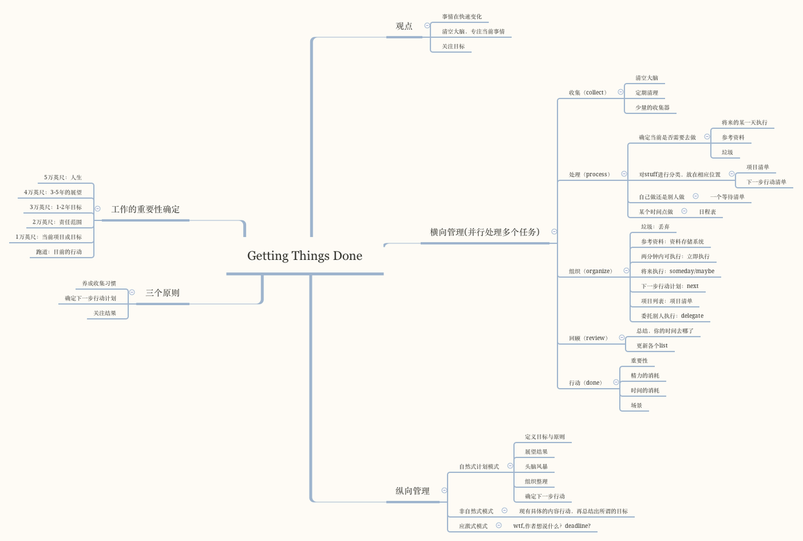
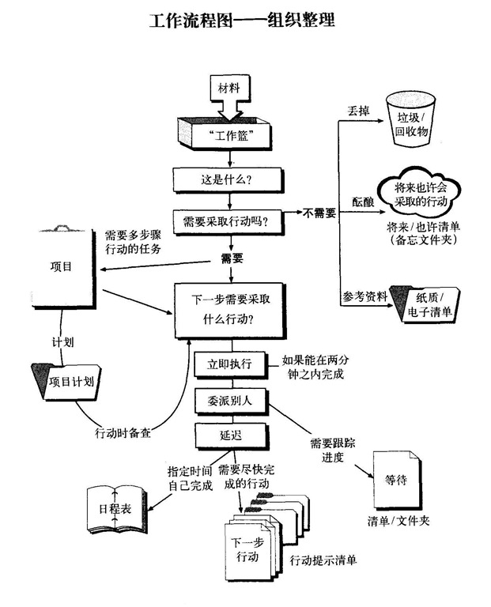
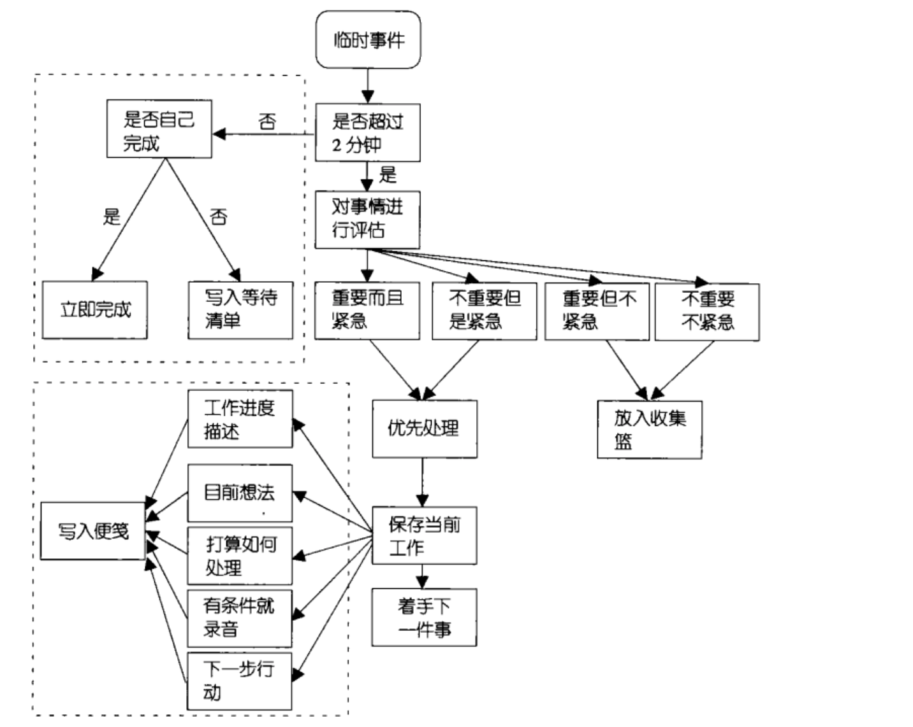

我们每天都工作，生活。但有时候，每天都很忙碌，却不知道自己在忙些什么。每个人的时间都是有限的，我不想碌碌无为，终其一生。我需要知道自己做了些什么，为什么做，在哪个时候做。我以《Getting Things Done》与《小强升职记》为主，《番茄工作法》为辅，构建自己的时间管理体系。

# Getting Things Done
3个东西：确定目标，横向管理，纵向管理

#### 确定目标：
你如何判断你的目标，确定做事情的优先级？
- 与同龄人沟通，一个人有时候会有太大的孤单感
- 与高等级比自己强大的人沟通（比如corey）
- 自我测验（如小强升职记）

#### 横向管理

这个流程图记录了一件事情如何进入gtd系统，最后被处理的

#### 纵向管理
是管理一个比较大的，重要的项目需要做的事情。
- 有着自己想达到的目标和原则
- 想想可能达到的结果，最好的，最坏的。
- 头脑风暴，把跟这个项目关联的，所有信息都记录下来，不做评判
- 整理目标原则，整理结果展望，整理头脑风暴信息。
- 确定下一步该干什么

#### 作者任务的观点
- 清空大脑（专注）
- 生活中只存在两个问题：
  + 你知道要达到的目标，但不知道怎么去做？
  + 你不知道你的目标是什么？
- 我们的最终目标是把各种工作和情况赶出你的大脑，但绝不丢弃有潜在价值的想法

# 小强升职记
这是一本比较实用的时间管理，个人管理书籍，值得深读，精读，多读。

#### 寻找种子
- 时间日志，找出时间黑洞，找出高效时间段，工作时间段法（基本的时间管理）
- 何为重要的事情，寻找自己的价值观，《职业价值观自测表》

#### 让种子发芽
- 四象限法则
- 猴子法则：学会说NO, 合理安排时间
- 脑袋同时只装一件事情
- gtd

#### 长出主干和枝桠
- smart原则
- 分解

#### 绿叶充实枝干
- 习惯的养成

#### 摘下够得着的果实
- 每日回顾，反思和总结
- 处理零时突发事件

## 问题
#### 如何处理中断？

# 番茄工作法
该方法，最总要的一个目的是讲一天的时间分成一个个不可分割的原子时间，确保原子时间内，保持高度集中。

番茄工作法是一套pdca流程（戴明环）

## 五个基本问题

#### 这是一本什么类型的书？
实用类型

#### 这本书描述了什么？
描述了如何运用番茄工作法，使自己如何在一天中专注的做事情。
- 计划：早上起来，计划一天做的事情
- 跟踪：执行，定闹钟循环的执行（专注工作-休息-专注工作-休息...）
- 记录与分析：记录完成情况（记录中断数），分析改进的方式
- 可视化：执行改进方式

在跟踪中，使用一个个番茄时间跟踪完成。

#### 作者的观点
- 一次只干一件事（专注）
- 大项目拆分成小项目 
- 分清事情优先级
- 总结与反思
- 说no, 把预估当成承诺
- 清空脑子
- 树立自信心（ 前怕狼后怕虎，害怕失败和批评）
- 没有什么完美主义（完美主义，碍手碍脚）
- 今日待办是一种承诺。
- 预估，根据历史记录预估，虽然有一些偏差

番茄工作法是一套pdca流程（戴明环）

#### 是否有道理？
感觉更gtd说的比较像，只是更加专注于每一天的处理控制。
> 番茄工作法是一套pdca流程（戴明环）

#### 自身经验
不会做时间管理，真在寻找一种合适自己的方式。感觉该方法比较死板。

#### 对我的用处
- 看该方法是否适合我
- 结合gtd构建自己的时间管理系统

## 重要句子
已在作者观点与书的描述中，提炼总结

## 提问

#### 如何处理中断？
中断分为内部中断和外部中断。
根据事情的紧急情况做区分。
- 不紧急：记录在收集箱中，继续当前番茄时间，延后分类处理
- 紧急：作废当前番茄时间，处理紧急事情。

#### 如何预估一个任务需要的时间？
根据历史预估，然后当天总结反馈。调整，再预估，迭代处理。

# 我的时间管理
- 确定自己的方向目标
- 用滴答清单，在收集箱中随时记录想到的东西
- 早上坐地铁，想想今天的事情
- 根据目标确定每一天/每一周/每一月的重要事情（四象限法则）
- 将复杂项目分解，成具体的可执行的下一步行动
- 每一天专注，我不适合使用番茄法。从清单中拿出一件事情，中断根据重要情况，紧急情况做适当处理，参加《小强升职记》中老付的处理方式
- 晚上回去，想想今天做了什么，为什么做？有什么改进的地方。

向往着更好的生活，更自由的时间，我一直在这条路上奔跑，good luck。